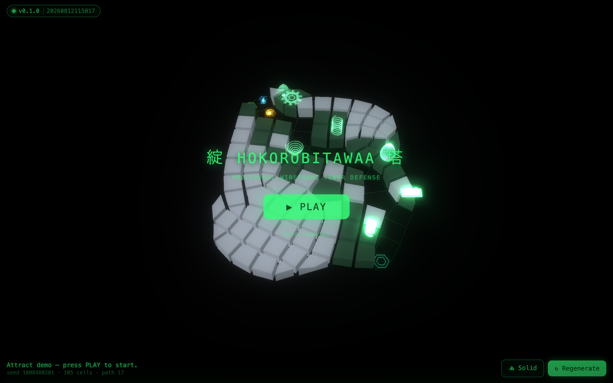

# 綻 HokorobiTawaa 塔

Mobile-first PWA tower defense on a procedural Stalberg board — green-on-black wireframe, rendered with Three.js.

**▶ Play:** https://kai-denrei.github.io/HokorobiTawaa/



## Develop

```bash
npm install
npm run dev      # local dev server
npm run build    # production build → dist/
npm run preview  # serve the built app
npm test         # run the test suite
```

Deployed to GitHub Pages via Actions on every push to `main`.
